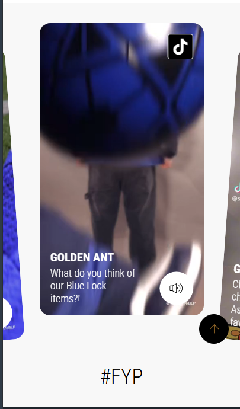

# Procesverslag
Markdown is een simpele manier om HTML te schrijven.  
Markdown cheat cheet: [Hulp bij het schrijven van Markdown](https://github.com/adam-p/markdown-here/wiki/Markdown-Cheatsheet).

Nb. De standaardstructuur en de spartaanse opmaak van de README.md zijn helemaal prima. Het gaat om de inhoud van je procesverslag. Besteedt de tijd voor pracht en praal aan je website.

Nb. Door *open* toe te voegen aan een *details* element kun je deze standaard open zetten. Fijn om dat steeds voor de relevante stuk(ken) te doen.

## Jij

  
uitwerken voor kick-off werkgroep

  ### Auteur:
  Anko Obeng 

  #### Je startniveau:
  Rood (kies uit zwart, rood óf blauw)

  #### Je focus:
  surface Plane (kies uit responsive óf surface plane)
 

## Je website

  
uitwerken voor kick-off werkgroep

  ### Je opdracht:
  [link naar de website die je gaat namaken óf de naam/omschrijving van je eigen ontwerp](https://shopgoldenant.com/)

  #### Screenshot(s) van de eerste pagina (small screen): 
  hier de naam van de pagina  
  

  #### Screenshot(s) van de tweede pagina (small screen):
  hier de naam van de pagina  
  
 

## Toegankelijkheidstest 1/2 (week 1)

  
uitwerken na test in 2e werkgroep

  ### Bevindingen
  Lijst met je bevindingen die in de test naar voren kwamen:
  
Ik heb geleerd dat alt-teksten bij afbeeldingen belangrijk zijn voor screenreaders.

Buttons moeten altijd een aria-label krijgen als er geen tekst in staat (zoals bij icon-buttons).

Contrasten tussen tekst en achtergrond moeten voldoende zijn.

## Breakdownschets (week 1)

  
uitwerken na afloop 3e werkgroep

  ### de hele pagina: 
  

  ### dynamisch deel (bijv menu): 
  

  ### wellicht nog een dynamisch deel (bijv filter): 
  

## Voortgang 1 (week 2)

  
uitwerken voor 1e voortgang

  ### Stand van zaken
  Wat ging goed:

Het bouwen van een hero section met achtergrondafbeelding en CTA-button.

Het gebruiken van CSS variabelen om kleuren en spacing consistent te houden.

Wat lastig was:

De hero image goed laten schalen (cover vs contain).

Zorgen dat het side-nav menu altijd boven de hero zichtbaar is.

  ### Agenda voor meeting
  samen met je groepje opstellen

  | student 1      | student 2          | student 3    | student 4        |
  | ---            | ---                | ---          | ---              |
  | dit bespreken  | en dit             | en ik dit    | en dan ik dat    |
  | en dat ook nog | dit als er tijd is | nog een punt | dit wil ik zeker |
  | ...            | ...                | ...          | ...              |

  ### Verslag van meeting
  hier na afloop snel de uitkomsten van de meeting vastleggen

  - punt 1
  - punt 2
  - nog een punt
  - ...

## Voortgang 2 (week 3)

  
uitwerken voor 2e voortgang

  ### Stand van zaken
 Wat ging goed:

Ik heb een product grid gemaakt met <ul> en <li> in plaats van 
 → semantisch correcter.

Ik heb geleerd hoe je met media queries de grid responsive maakt.

Wat lastig was:

Het combineren van filters (select option) met JavaScript filtering.

Het voorkomen dat filters en producten door elkaar heen sprongen bij resizing.

  ### Agenda voor meeting
  samen met je groepje opstellen

  | student 1      | student 2          | student 3    | student 4        |
  | ---            | ---                | ---          | ---              |
  | dit bespreken  | en dit             | en ik dit    | en dan ik dat    |
  | en dat ook nog | dit als er tijd is | nog een punt | dit wil ik zeker |
  | ...            | ...                | ...          | ...              |

  ### Verslag van meeting
  hier na afloop snel de uitkomsten van de meeting vastleggen

  - punt 1
  - punt 2
  - nog een punt
- ...

## Toegankelijkheidstest 2/2 (week 4)

  
uitwerken na test in 9e werkgroep

  ### Bevindingen
  Verbeteringen sinds de eerste test:

Alle video’s kregen play/pause knoppen met duidelijke labels.

Ik heb de carousel bedienbaar gemaakt met toetsenbord pijltjestoetsen.

Buttons hebben een hover/focus-staat voor beter visueel feedback.

## Voortgang 3 (week 4)

  
uitwerken voor 3e voortgang

  ### Stand van zaken
  hier dit ging goed & dit was lastig (neem ook screenshots op van delen van je website en code)

  ### Agenda voor meeting
  samen met je groepje opstellen

  | student 1      | student 2          | student 3    | student 4        |
  | ---            | ---                | ---          | ---              |
  | dit bespreken  | en dit             | en ik dit    | en dan ik dat    |
  | en dat ook nog | dit als er tijd is | nog een punt | dit wil ik zeker |
  | ...            | ...                | ...          | ...              |

  ### Verslag van meeting
  hier na afloop snel de uitkomsten van de meeting vastleggen

  - punt 1
  - punt 2
  - nog een punt
  - ...

## Eindgesprek (week 5)

  
uitwerken voor eindgesprek

  ### Je uitkomst - karakteristiek screenshots:
  

  ### Dit ging goed/Heb ik geleerd: 

Ik kan nu zelf een carousel bouwen met JS (autoslide + handmatige controls).

Ik weet hoe je CSS Grid en Flexbox gebruikt voor layouts.

Ik heb geleerd hoe belangrijk semantiek en toegankelijkheid zijn.

  ### Dit was lastig/Is niet gelukt:
Soms werkte de play-knoppen van de video’s niet direct → debugging nodig.

Het responsive maken van de hero image kostte veel tijd.

  

## Bronnenlijst

  
continu bijhouden terwijl je werkt

  Nb. Wees specifiek ('css-tricks' als bron is bijv. niet specifiek genoeg). 
  Nb. ChatGpT en andere AI horen er ook bij.
  Nb. Vermeld de bronnen ook in je code.

1. MDN Web Docs – documentatie over HTML, CSS, JS.

2. ChatGPT – hulp bij debuggen van CSS/JS en bij schrijven van toegankelijke code.

<a href="(https://css-tricks.com/css-carousels/)">
   3. CSS-Tricks – artikel over carousels en grids.             
 </a>

4. W3C Accessibility Guidelines.

